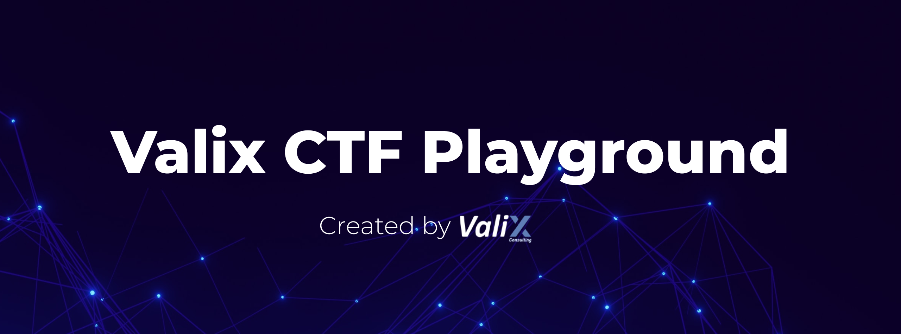

# Valix CTF Playground
An interactive Ethereum-based platform for mastering offensive security in Smart Contracts.

# Disclaimer
The smart contracts in this repository are intended for learning the offensive security aspects of Ethereum smart contracts. Some contracts are vulnerable, some are simplified for minimal, some contain malicious code. Hence, do not use the source code in this repository in your production.

Nonetheless, feel free to contact **Valix Consulting** for your smart contract consulting and auditing services.🕵

# Challenges
| #             |       Name    |
| ------------- | ------------- |
| 1  | Extra Bank  | 
| 2  | Lock Pool  |
| 3  | NFT Whitelist  |
| 4  | Poor Boy  |
| 5  | The Collector  |
| 6  | Bullied Boy  |
| 7  | The Secret Source  |
| 8  | Trick or Thieve  |
| 9  | Lotto888 |
| 10  | Alice in The Dark  |
| 11  | Freeze The Flow  |

# How to play
1. Clone this repository
2. Install dependencies with `npm install`
3. Code your solution in the `*.challenge.js` file (inside each challenge's folder in the test folder). 
4. In all challenges you must use the account called `player`. In Ethers, that may translate to using `.connect(player)`.
5. Run the challenge with `npm run <<challenge-name>>` If the test is executed successfully, you've passed!

# Important Notes
- Solidity is absolutely required.
- Typescript knowledge is beneficial but not a must-have
- To code the solutions, you may need to read Ethers and Hardhat docs.
- Some challenges require you to code and deploy custom smart contracts. Keep them in the `contracts/@player-contracts`

# About Valix Consulting
**Valix Consulting** is a blockchain and smart contract security firm offering a wide range of cybersecurity consulting services. Our specialists, combined with technical expertise with industry knowledge and support staff, strive to deliver consistently superior quality services.

For any business inquiries, please get in touch with us via [Twitter](https://twitter.com/valixconsulting), [Facebook](https://www.facebook.com/ValixConsulting), or [info@valix.io](mailto:info@valix.io).

# Inspiration
Inspiration by [Damn Vulnerable DeFi](https://www.damnvulnerabledefi.xyz/).